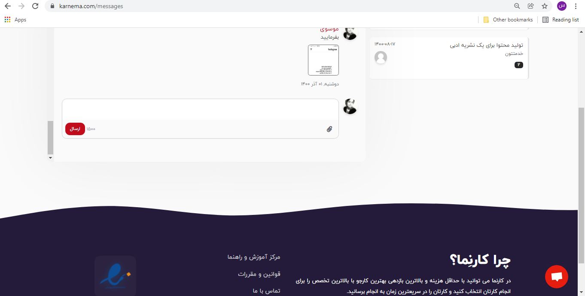
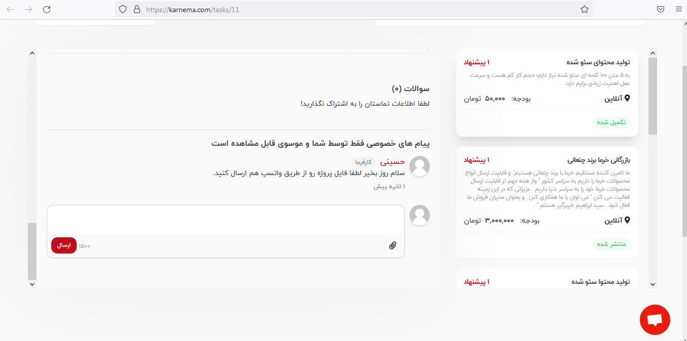
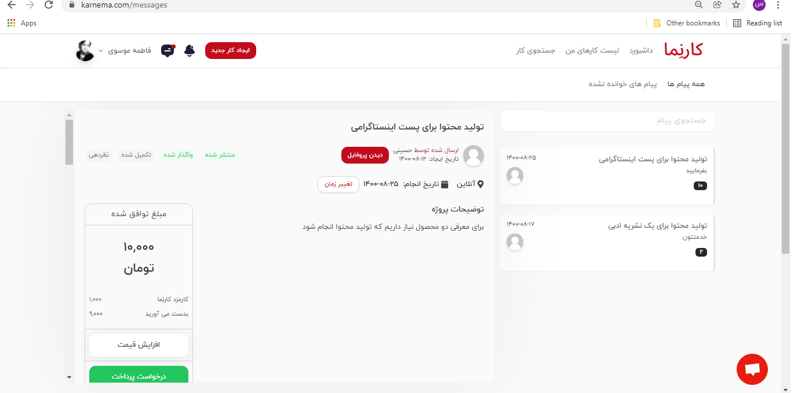

**مزیت استفاده از چت خصوصی**

قابلیت چت خصوصی با کاربران جهت حفظ امنیت بیشتر کارجویان و کافرمایان طراحی شده است؛ چت خصوصی با کاربران این مزیت را برای کاربران ایجاد می‌کند تا بتوانند در محیطی امن در مورد پروژه با هم گفت‌و‌گو کنند.باعث می‌شود بتوانید تمام فعالیت‌های کاری خود را در محیطی مشخص انجام دهید.

**استفاده از قابلیت چت خصوصی با کاربران**

این قابلیت تنها در صورتی فعال می‎شود که کارفرما، پروژه را به کارجو واگذار کرده باشد. چت خصوصی در انتهای آگهی پروژه قرار دارد و کارفرما و کارجو می‎توانند از این طریق، فایل‎های مربوط به پروژه را برای هم ارسال نمایند. پیام‎های رد و بدل شده در بخش چت خصوصی، فقط برای طرفین پروژه قابل مشاهده است.

چت خصوصی یک قابلیت برای طرفین پروژه است؛ یعنی هم کارجو و هم کارفرما می‌توانند از طریق این قابلیت برای یک‎دیگر پیام یا فایل‌های مربوط به پروژه را ارسال کنند. بعد از ارسال پیام، یک اعلان برای شخص مقابل ارسال می‌شود. پیام‌های دریافتی و ارسال شده در بخش &quot;پیام‌ها&quot; قابل مشاهده است.

