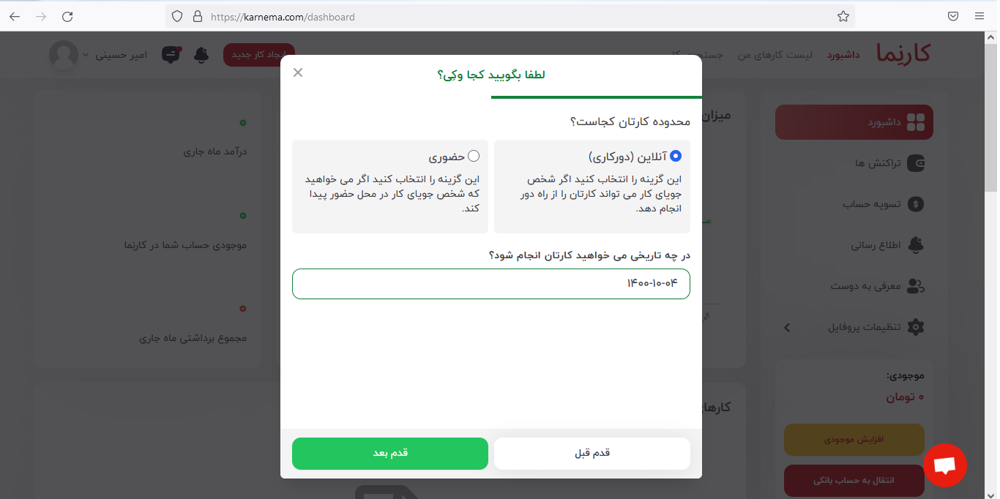
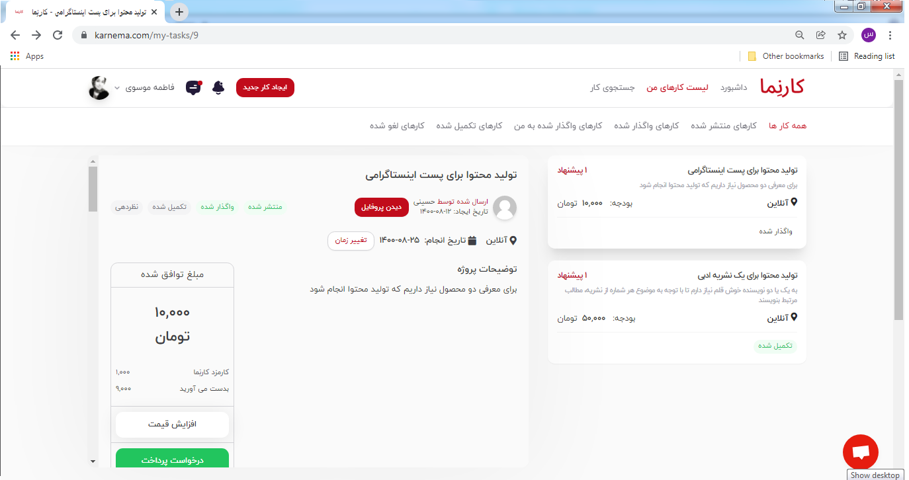
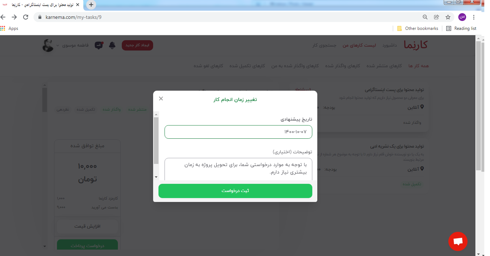

هنگام تعریف پروژه، این‌امکان برای کارفرما فراهم است که تاریخ مد نظر خود را برای تحویل گرفتن پروژه، مشخص کند. تعیین تاریخ انجام کار، برای کارفرمایانی که تاریخ خاصی را برای تحویل پروژه در نظر دارند مفید است. کارجویان نیز می‌توانند پروژه‌ها را طبق زمان فراغت خود انتخاب کنند و برای پروژه‌هایی درخواست ارسال نمایند که زمان کافی برای انجام آن داشته باشند.

**تغییر تاریخ انجام کار**

تاریخ انجام کار، مسئله‌ای قراردادی میان کارجو و کارفرماست؛ بنابراین کارفرما و کارجو می‌توانند بر سر تاریخ تحویل با هم به توافق برسند‌. کارجو می‌تواند تاریخ پیشنهادی خود را از طریق کلیک بر گزینه &quot;تغییر زمان&quot; به اطلاع کارفرما برساند؛ کارفرما پس از انتشار آگهی نیز می‌تواند تاریخ تحویل پروژه را ویرایش نماید.

