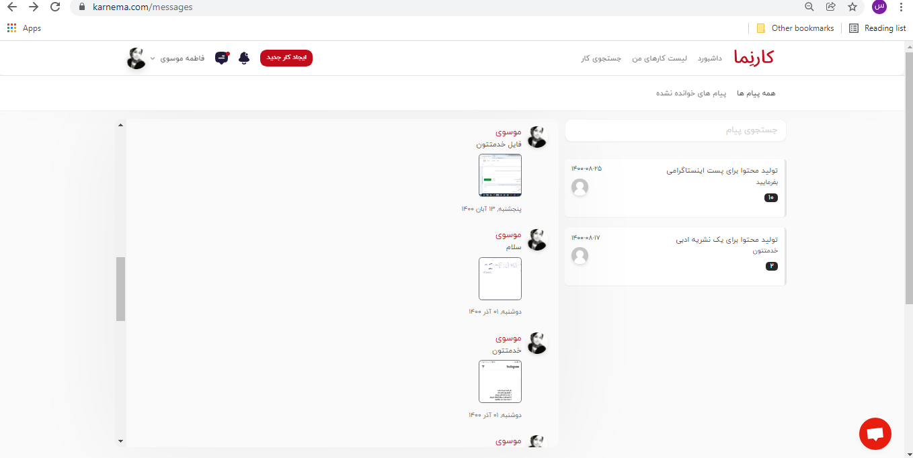

کارجو و کارفرما امکان ارسال تصاویری را دارند که در سایت کارنما تعریف شده باشد. به این منظور حجم تصاویر ارسالی، می‌بایستحداکثر 1 مگابایت باشد. برای ارسال فایل‌های بالاتر از حجم 1 مگابایت، می‌توانید حجم تصویر را به وسیله سایت‌های فشرده‌سازی تصویر کاهش دهید.

وبسایت کارنما از تصاویر با فرمت‌های jpg، jpeg، ico، webp، svg و gif پشتیبانی می‌کند. کارجو و کارفرما می‌توانند از بخش &quot;چت خصوصی&quot;، تصاویر مربوطه را برای هم ارسال نمایند.

