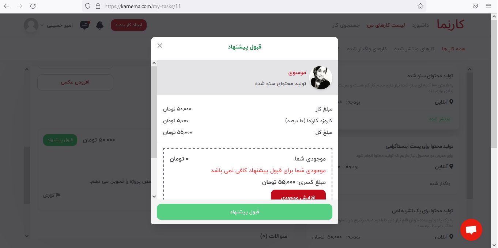
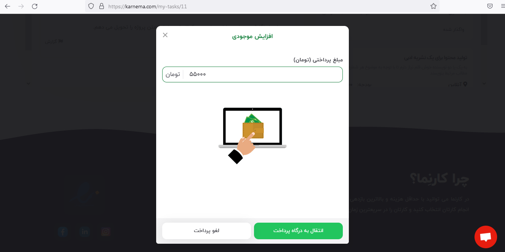
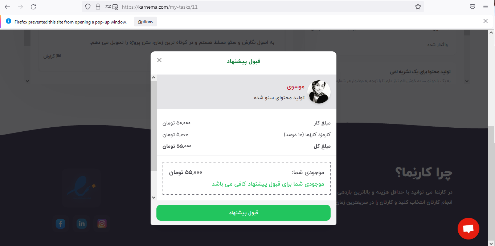
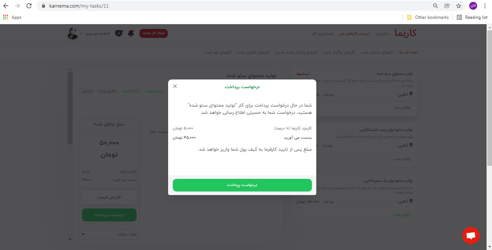
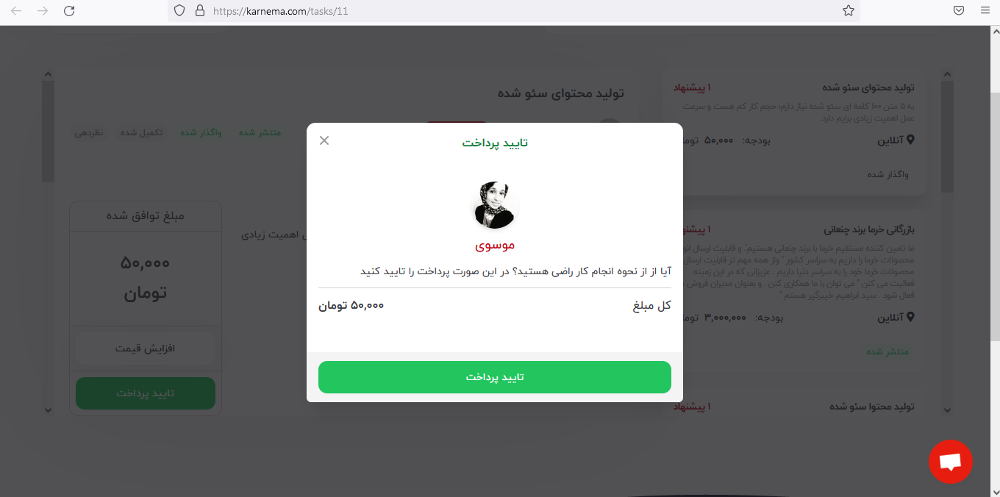
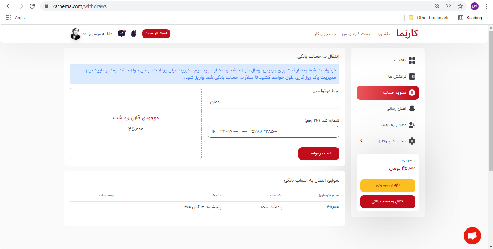

**پرداخت پول توسط کارفرما**

هر گاه کارفرما بخواهد درخواست یکی از کارجویان را قبول کند، می‌بایست قبل از واگذار کردن پروژه، دستمزد توافق شده را پرداخت نماید و تا زمانی که کارجو پروژه را به کارفرما تحویل نداده باشد، این مبلغ نزد سایت کارنما به امانت می‌ماند.

کارفرما برای پرداخت مبلغ پروژه، باید کیف پول خود را شارژ کند؛ در صورتی که موجودی کیف پول برای پرداخت دستمزد توافق شده کافی نباشد، می‌توان با کلیک بر روی گزینه &quot; انتقال به درگاه پرداخت&quot;موجودی کیف پول را افزایش داد.

کارفرما پس از شارژ کردن کیف پول خود، می‎تواند درخواست کارجو را قبول کند.

**دریافت پول توسط کارجو**

کارجو برای دریافت دستمزد انجام پروژه، می‌بایست وارد بخش آگهی پروژه شود و روی گزینه درخواست پرداخت، کلیک نماید. مبلغ پروژه تنها در شرایطی قابل پرداخت است ک کارجو پروژه را به کارفرما تحویل داده باشد.

**آزادسازی پول**

بعد از این که کارجو، درخواست پرداخت را برای کارفرما ارسال کرد، کارفرما می‌تواند روی گزینه &quot;تایید پرداخت&quot; کلیک نماید و مبلغ پروژه را برای کارجو آزاد کند.

برای این که کارجو بتواند مبلغ دستمزد را از حساب کاربری خود در وبسایت کارنما آزاد کند باید وارد بخش داشبورد شود و از قسمت سمت راست صفحه، روی گزینه &quot;انتقال به حساب بانکی&quot;کلیک نماید. پس از ثبت درخواست انتقال وجه، با مراجعه به بخش &quot;تسویه حساب&quot;، می‎توان روند رسیدگی به درخواست را از طریق بخش &quot; سوابق انتقال به حساب بانکی&quot; که در پایین صفحه قرار دارد، مشاهده نمود. درخواست شما برای بازبینی تیم مدیریت وبسایت کارنما ارسال می‌شود و پس از تایید درخواست، مبلغ به حساب شما واریز می‌گردد.

